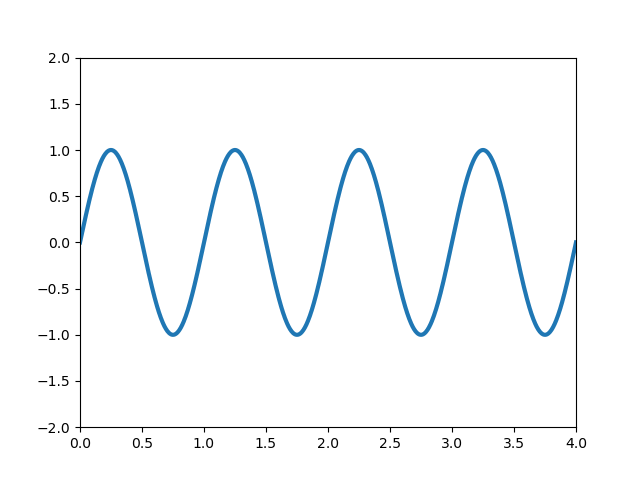

\begin{equation}
    \label{eq:pre}
    F1(x) = \int^x{f(x')dx'}
\end{equation}

\begin{equation}
    F2(x) = \int^x{f(x')dx'}
\end{equation}

# Заголовок Страницы

пустая ссылка ::
\begin{equation}
    \label{eq:zeroeq}
    F3(x) = \int^x{f(x')dx'}
\end{equation}

\begin{equation}
    F4(x) = \int^x{f(x')dx'}
\end{equation}

## Header2

inline формула делается так: $\cfrac{1}{x}$, а формула с новой строки так:

$$
    \int_a^b{f(x)dx} = F(b)-F(a)
$$

Также можно использовать latex синтаксис

\begin{equation}
    F11(x) = \int^x{f(x')dx'}
\end{equation}

\begin{equation}
    F12(x) = \int^x{f(x')dx'}
\end{equation}

\[
    \newcommand{\sslashed}[1]{\mathord{\mkern-1mu#1\mkern-9mu/}}
\]

\[
    S_F(k) = i \frac{\sslashed{k} +m}{k^2-m^2+i\epsilon}
\]

## Header2 1

\begin{equation}
    \label{eq:second}
    F21(x) = \int^x{f(x')dx'}
\end{equation}

\begin{equation}
    F22(x) = \int^x{f(x')dx'}
\end{equation}

### h3 1

\begin{equation}
    \label{eq:third}
    F211(x) = \int^x{f(x')dx'}
\end{equation}

\begin{equation}
    F212(x) = \int^x{f(x')dx'}
\end{equation}

### h3 2

\begin{equation}
    \label{eq:third} 
    F221(x) = \int^x{f(x')dx'}
\end{equation}

??? note "Вложенное"
    Вложенное предложение, теорема или еще что-то

??? info "Вывод формулы"
    === "1"
        Упрощаем выражение:

        $$ 
        X = (a + b)^2 
        $$

    === "2"
        Раскрываем скобки:

        $$ 
        X = (a + b)(a + b) 
        $$

    === "3"
        Получаем результат:

        $$ 
        X = a^2 + 2ab + b^2 
        $$

## Вставка контента {#another-id}

{width=400 }
{width=400 }

{width=400 }

## meramid diagrams

## Ссылки и превью

\begin{equation}
    F(x) = \int^x{f(x')dx'}
\end{equation}

\begin{equation}
    F(x) = \int^x{f(x')dx'}
\end{equation}

В ссылке нужно указать текст и id [текст ссылки](#header2){data-preview}

В ссылке нужно указать текст и id [уравнение](#eq:pre){data-preview}

Если нужно сослаться на другой файл:  [текст ссылки](../Chapter2/page2.md#eq:squares){data-preview}